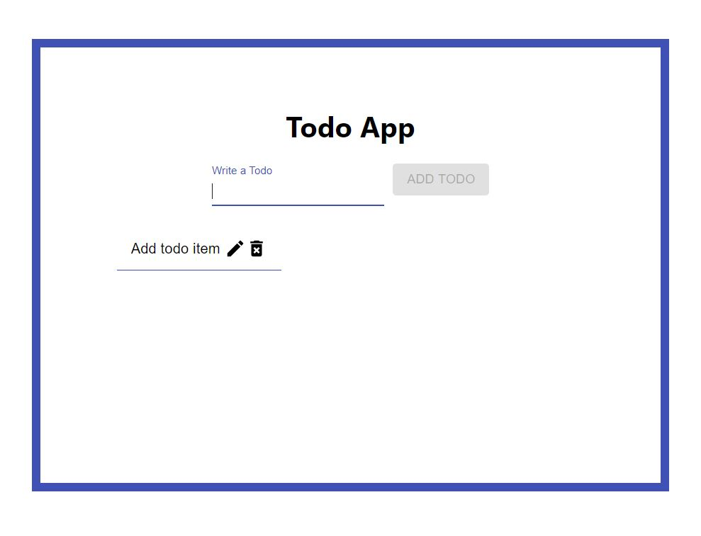

# todo-list-app
Built TODO app that lets you add todos to your list and edit or delete them based on if you have completed them or not.

# check it out here
https://todo-list-app-a1b10.web.app/

# Motivation
I built this project because I wanted to build something that people could use to help get things done.

---

## Table of Contents

- [Installation](#installation)
- [Features](#features)
- [Support](#support)
- [Tech](#tech)

---

# Screenshots


<br />

# Tech

#### Built with
- [React][react]
- [Material-ui][material]

# Features
This project has a minimal design that allows you to add, edit, and delete todo items. I used firebase as the database to store the added todos and allowing updating and deleting.

# Code Example
```
function App() {
  const [todos, setTodos] = useState([]);
  const [input, setInput] = useState('');

  useEffect(() => {
    db.collection('todos').orderBy('timestamp', 'desc').onSnapshot(snapshot => {
      setTodos(snapshot.docs.map(doc => ({id: doc.id ,todo: doc.data().todo})))
    })
  }, []);

  const addTodo = (event) => {
    event.preventDefault();

    db.collection('todos').add({
      todo: input,
      timestamp: firebase.firestore.FieldValue.serverTimestamp()
    });

    setTodos([...todos, input]);
    setInput('');
  }
  return (
    <div className="App">
      <h1>Todo App</h1>
      <form>
        <FormControl>
          <InputLabel>Write a Todo</InputLabel>
          <Input value={input} onChange={event => setInput(event.target.value)} />
        </FormControl>
        <Button className='btn-app-submit' disabled={!input} type='submit' onClick={addTodo} variant="contained" color="primary">
          Add Todo
        </Button>
      </form>
      <ul className="ul-app-todos">
        {todos.map(todo => (
          <Todo todo={todo} />
        ))}
      </ul>
    </div>
  );
}
  ```

# Installation

> Clone to your local machine
`https://github.com/ardissam0/todo-list-app.git`

> Setup
```
$ npm i
$ npm start
```

# Support
Reach out to me on social media if you have any questions!

[][twitter]
[][linkedin]
[][instagram]

[website]: https://samardis.com/
[twitter]: https://twitter.com/samuel_ardis
[instagram]: https://www.instagram.com/samuel.d.ardis/
[linkedin]: https://www.linkedin.com/in/samuel-ardis/
[react]: https://reactjs.org/
[material]: https://material-ui.com/
